You can use the CoderSchool Platform bot in Discord to reschedule an existing mentor session without leaving Discord. This guide explains how to send a reschedule request and how to respond when someone sends one to you.

<Info>
  You must already have a scheduled mentor session on CoderSchool Platform before you can reschedule it via Discord.
</Info>

## Part A: Sending a reschedule request (Requester)

You are the **Requester** when you initiate the reschedule (you send the request).

### Step 1: Use the /reschedule command

1. Open any channel in the CoderSchool Discord server.
2. In the message box, type the slash command `\reschedule`.
3. Select the **/reschedule** command from the Discord menu and press **Enter** to send it.

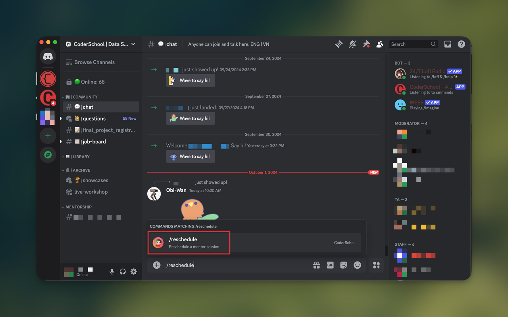

### Step 2: Check your DM with the bot

After you run the command:

- The CoderSchool Platform bot sends you a direct message (DM).
- If you have multiple mentors or learners linked to your account, the bot may ask you to select one before continuing.

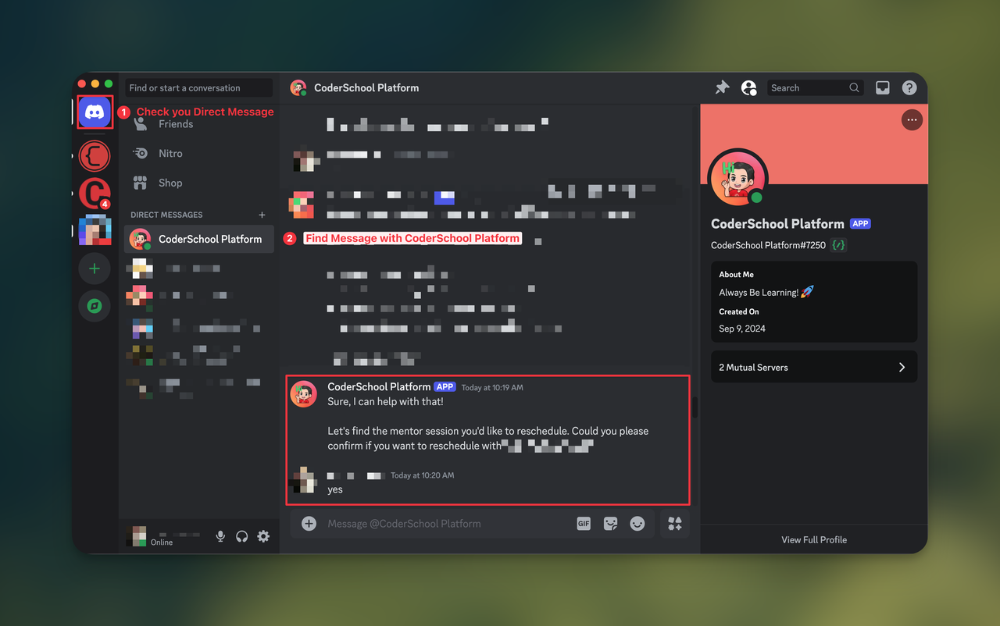

Follow the prompts in the DM to continue.

### Step 3: Choose the mentor session to reschedule

In the DM:

1. The bot shows you a list of mentor sessions that can be rescheduled.
2. Select the mentor session you want to change.

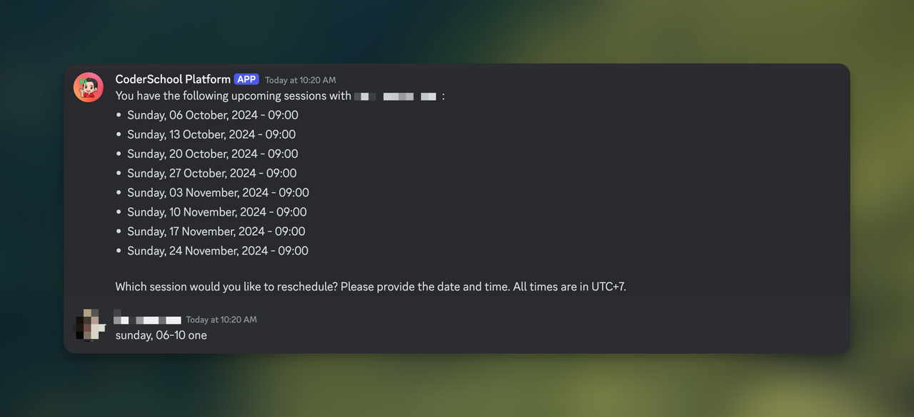

3. Confirm your selection when the bot asks you to.

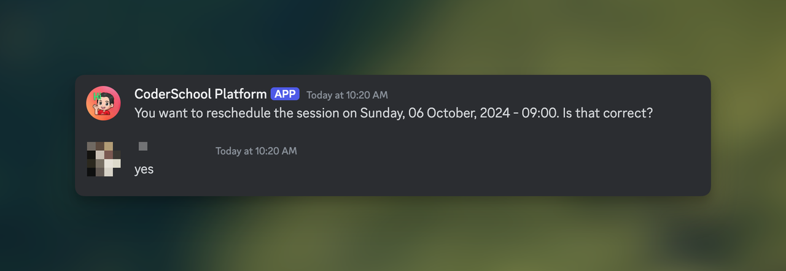

### Step 4: Provide a reason

The bot asks you to explain why you want to reschedule the session.

- Type a short but clear reason (for example: “Schedule conflict with work” or “Need more time to finish assignment”).
- Send your message so the bot can attach it to the reschedule request.

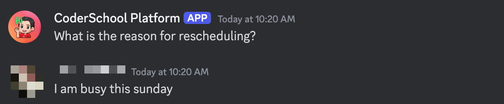

### Step 5: Propose a new time

Next, propose a new time slot:

1. Choose a date and time that fits within the allowed time range the bot shows.
2. Make sure the new time:
   - Is not in the past
   - Follows any constraints described by the bot

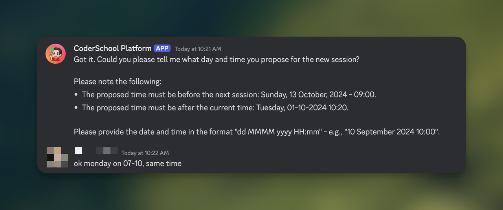

3. Confirm the proposed time slot when prompted.

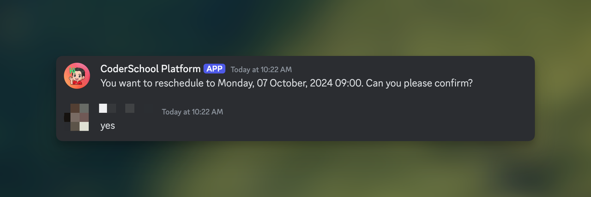

### Step 6: Confirm the reschedule request

The bot summarizes your reschedule request, including:

- The original session
- The new proposed date and time
- Your reason for rescheduling

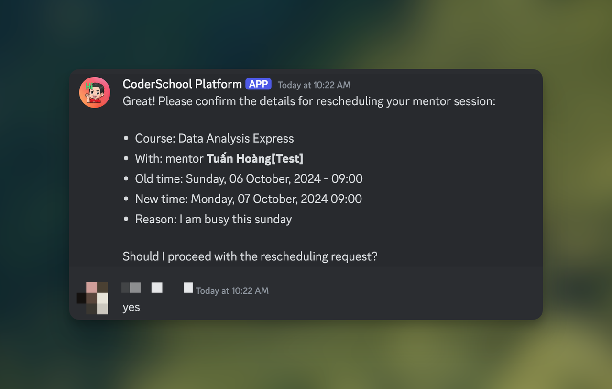

Review the summary and:

1. Confirm if all details are correct.
2. Or tell the bot if you need to change something and follow its prompts.

Once you confirm, the request is submitted and the flow ends.

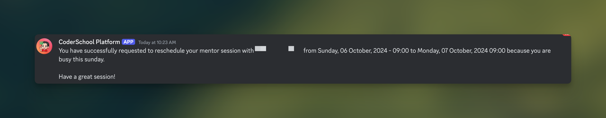

## Part B: Responding to a reschedule request (Requestee)

You are the **Requestee** when someone else sends you a reschedule request (for example, your mentor or your learner).

When a request is sent:

1. Check your Discord DMs from the CoderSchool Platform bot.
2. Read the details of the proposed change: session, new time, and reason.
3. Choose your response:
   - **Accept** the new time if it works for you.
   - **Reject** it if it does not work.

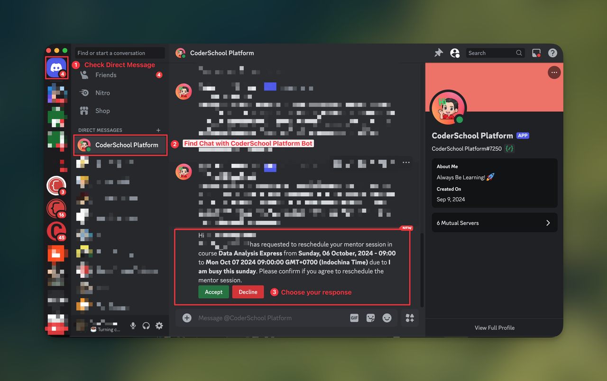

If you reject, you may be asked to provide a short reason so the other person understands why.

## Part C: Result and final status

After a reschedule request is processed:

- The final result is shown in the learner’s mentorship channel on Discord.
- The mentor session on CoderSchool Platform is updated if the request is accepted.

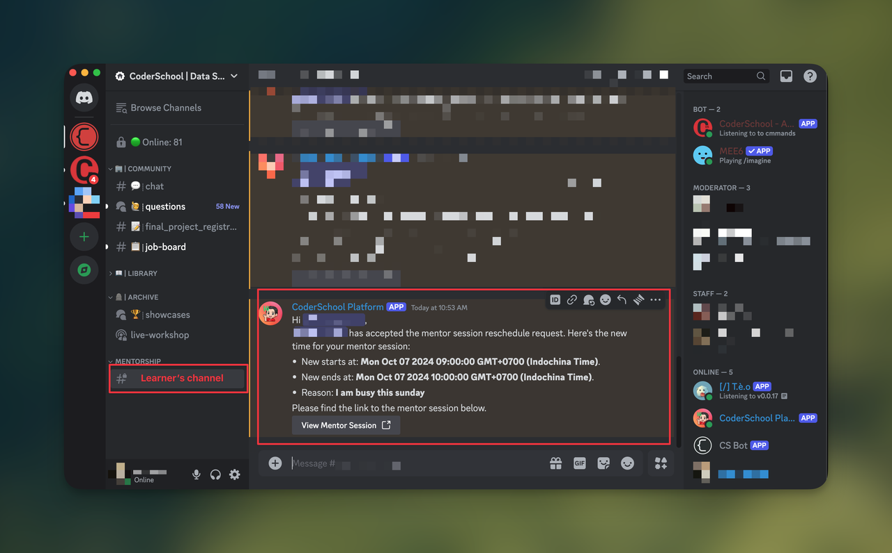

<Tip>
  Always confirm any new date and time with your mentor or learner, and double-check your sessions on CoderSchool Platform after a reschedule is completed.
</Tip>

