You can book Teaching Assistant (TA) sessions directly from the CoderSchool Discord server using the Platform bot. This guide shows you how to start a booking, chat with the bot, and confirm your session.

## What TA sessions are for

TA sessions are designed to help you:

- Clarify lab questions and solutions
- Ask about assignments or concepts you do not understand
- Catch up with the course if you are falling behind

TA sessions are **not** a replacement for your own self-learning or your mentor sessions. They are **not** where the TA reteaches the whole course content for you.

If you have a quick question about the course material, it is usually best to first post it in the **Discord Questions Center**. A TA will normally answer you there within **about 30 minutes**. If you still need deeper help after that, you can book a TA session.

<Info>
  You must be an enrolled learner and a member of the CoderSchool Discord server to use TA booking.
</Info>

## Step 1: Request a TA booking

1. Go to any channel in the CoderSchool Discord server (we recommend your mentorship or learner channel).
2. In the message box, type the slash command `\book`.

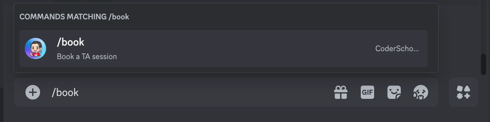

3. When the Discord command menu appears, click **/book** to select it.

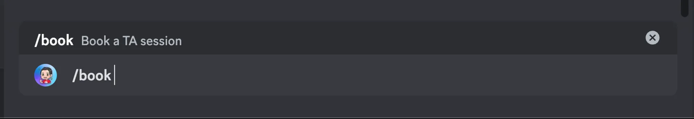

4. Press **Enter** (or **Return** on Mac) to send the command.

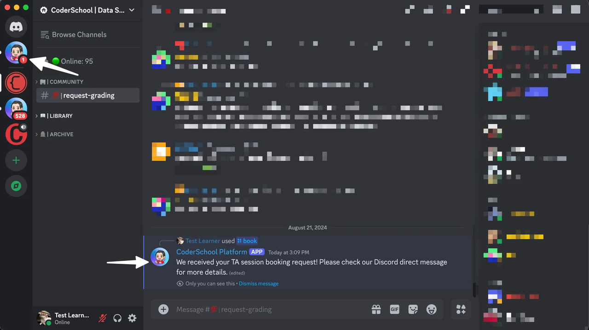

You should receive two things:

1. A confirmation message from the bot in the channel that says **"We received your TA session booking request"**.
2. A new direct message (DM) from the CoderSchool Platform bot. Click the DM icon on the left sidebar to open the conversation.

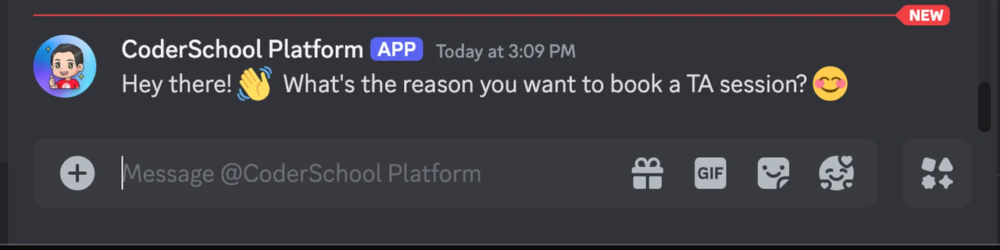

## Step 2: Chat with the bot

When you open the DM, the bot starts a chat to collect details for your TA session.

1. **Describe your reason**: The bot asks why you want to book a TA session.
   - Be as clear and detailed as possible.
   - Include the topic, assignment, or concept you need help with.

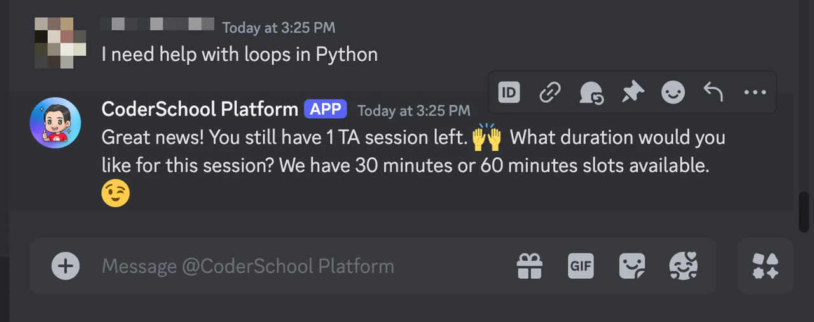

2. **Validation and remaining sessions**: If your reason is valid, the bot checks how many TA sessions you still have left.
3. **Choose a duration**: The bot asks you to choose a time slot length, usually **30 minutes** or **60 minutes**. Select the option that best fits your needs.

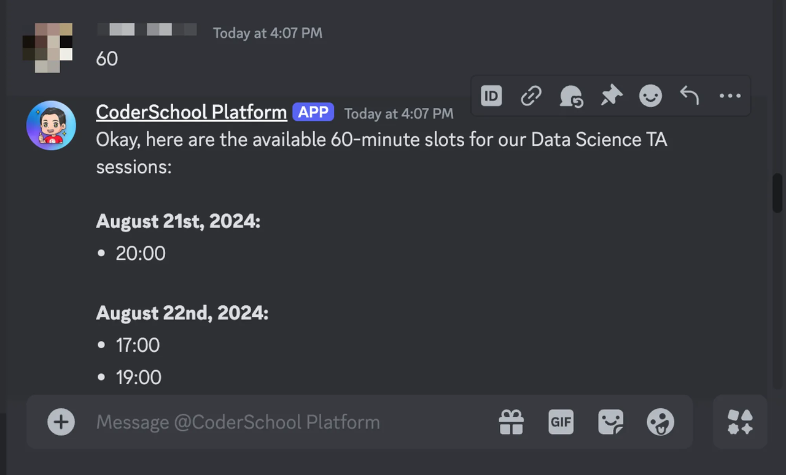

4. **View available times**: The bot thinks for a bit and then shows you the available time slots for your TA session.
5. **Pick a time**: Type the time you want to book, following the format the bot asks for.

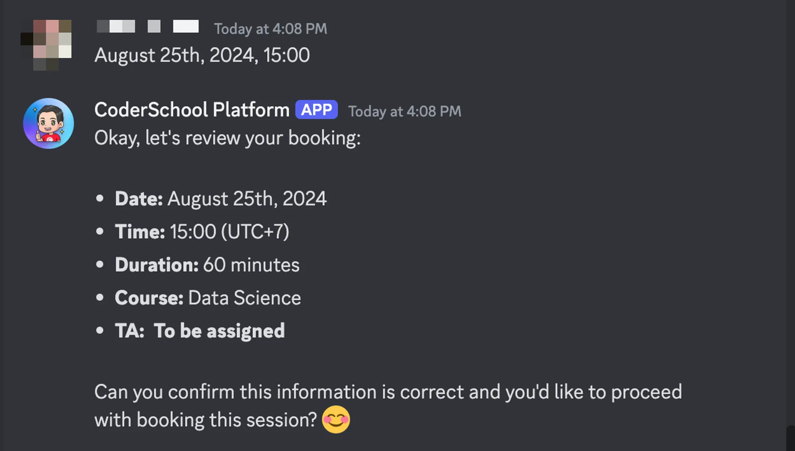

The bot may ask follow-up questions if it needs more information to complete your booking.

## Step 3: Confirm your TA session

Before the booking is created, the bot shows you a summary of your request and asks you to confirm.

1. Review the session details: date, time, duration, and purpose.
2. If something is wrong, tell the bot what you want to change and follow its prompts.

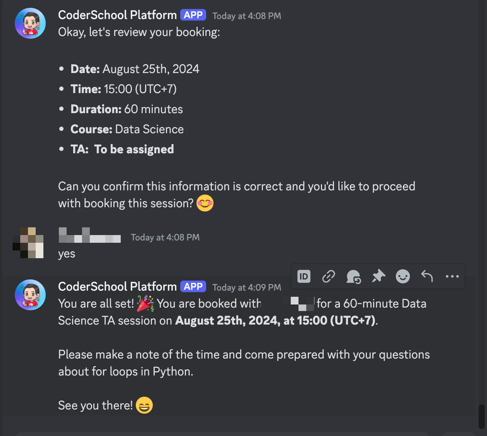

3. When everything looks correct, confirm the booking in the chat.

Once confirmed, the bot books the TA session for you.

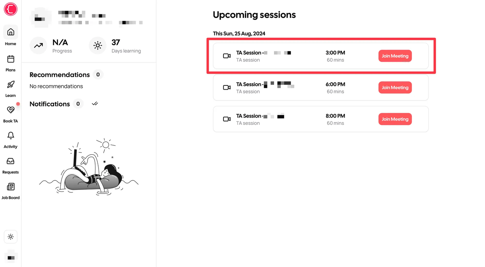

<Tip>
  After the bot books your session, go to CoderSchool Platform and open your mentor sessions to see the newly created TA session. From there, you can join the session or copy the Zoom link when it is time.
</Tip>

## Ending or canceling a chat

The chat session with the bot is considered **ended** when you receive the final confirmation message that your booking is complete.

If you want to:

- **Start a new booking later**: Go back to any Discord channel and use the `\book` command again.

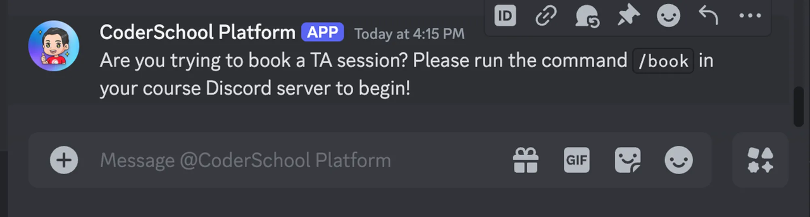

- **Cancel the current booking process**: Tell the bot you want to cancel.

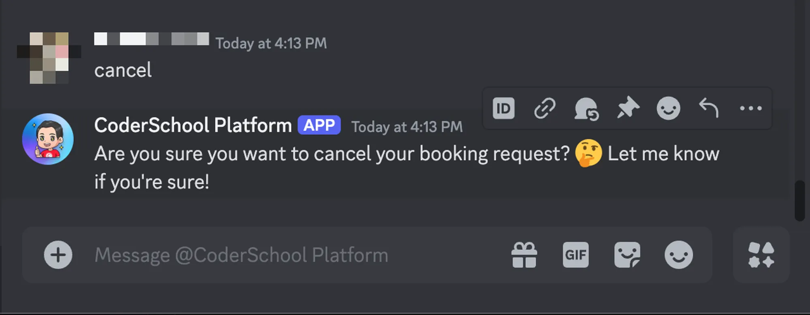

The bot asks you to confirm canceling the process. If you confirm, it stops the current booking flow and does not create a TA session.

